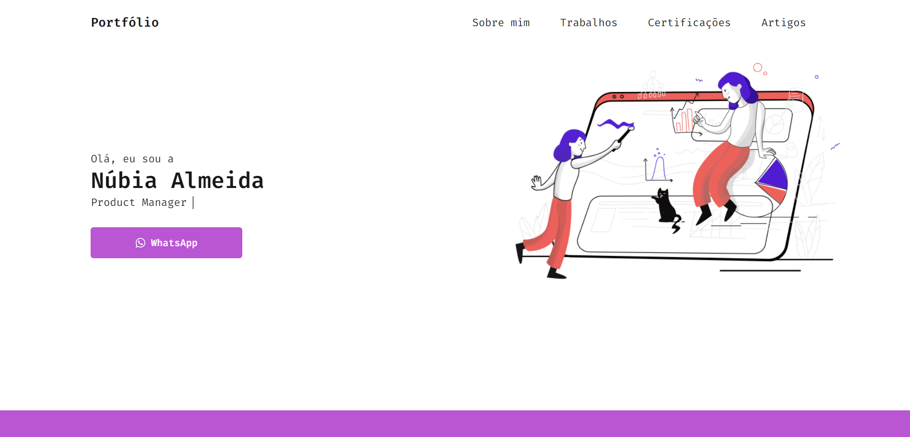

<h1 align="center">
  📰 Meu Portfólio
</h1>

<h4 align="center">
  Criei este portfólio para mostrar meus trabalhos, habilidades e certificações ao longo da minha carreira profissional.
  Apreciem e entre em contato comigo caso tenha dúvidas.
</h4>

<h4 align="center"><a href="https://nubialmeida.github.io">Clique para acessar o projeto</a></h4>

## 📚 Seções
O portfólio é composto por 5 seções:

- **Home**
- **Sobre mim**
- **Trabalhos**
- **Certificações**
- **Artigos**

---

## 💼 Tecnologias utilizadas
Para o desenvolvimento deste portfólio as linguagens abaixo foram utilizadas:

- HTML;
- Sass;
- JavaScript;

---

## 🦄 Autora 
<table>
  <tr>
    <td align="center">
      <a href="https://github.com/nubiaalmeida">
         
        
          <b>Núbia Almeida</b>
        
      </a>
    </td>
  </tr>
</table>